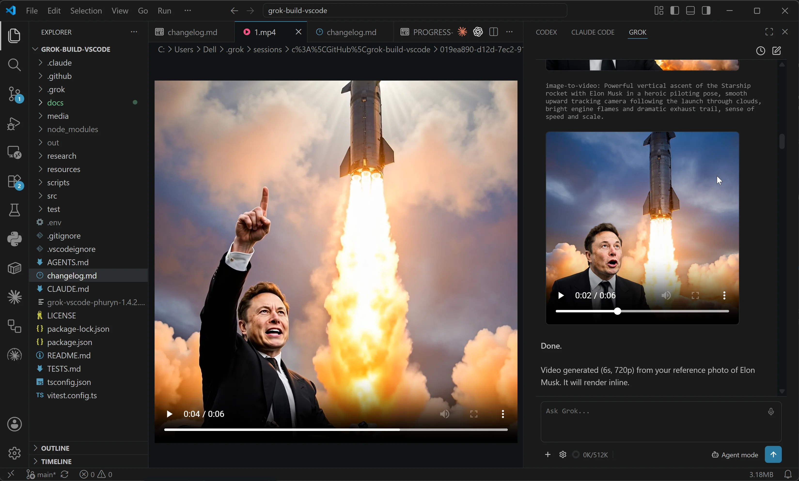
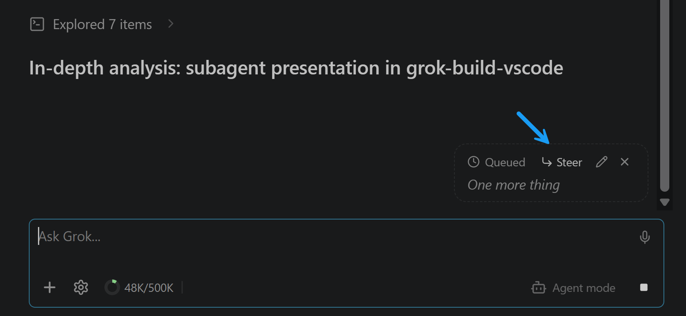
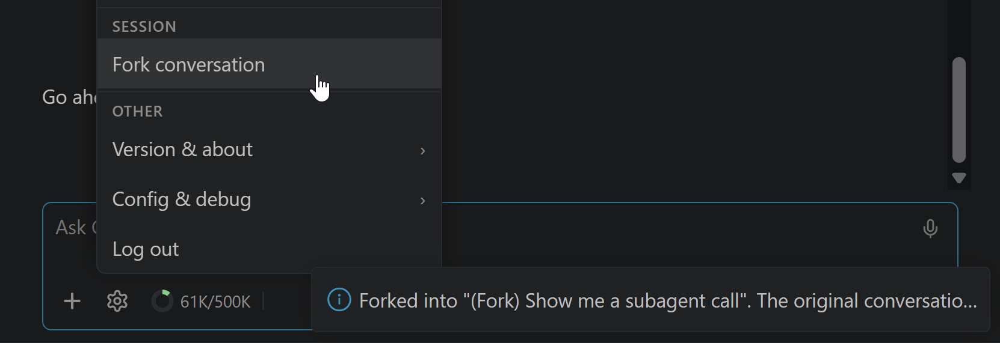
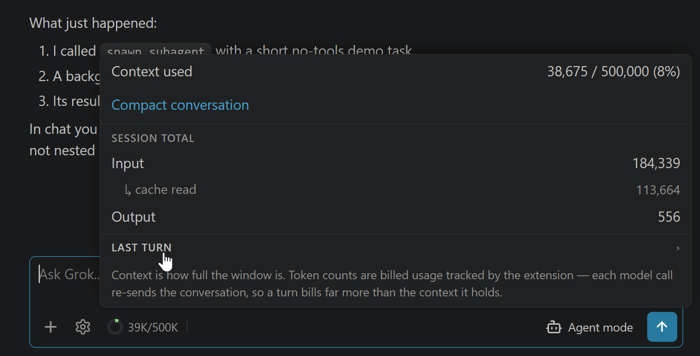
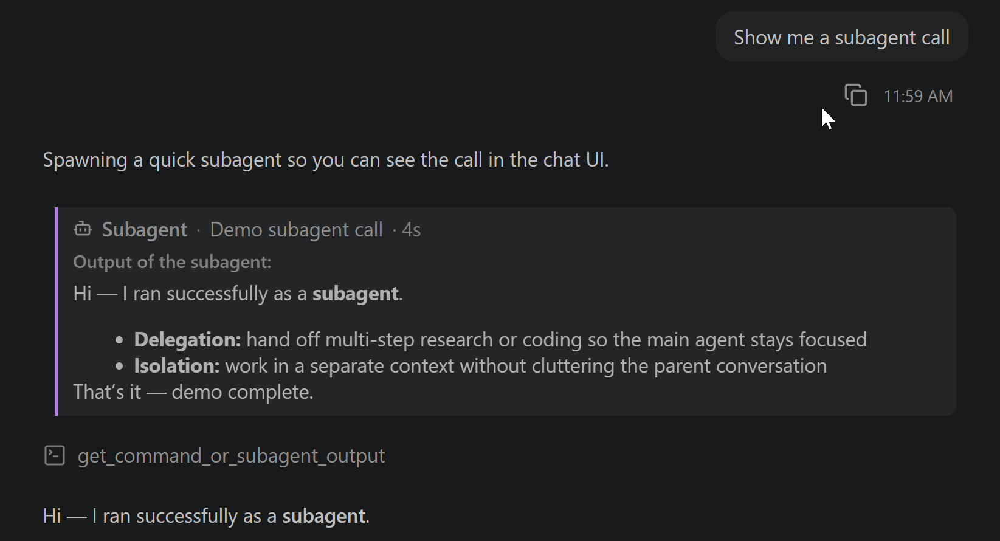

# Grok Build for VS Code (Community)

[](LICENSE) [](https://code.visualstudio.com) [](#) [](https://www.productcompass.pm)

> **GUI for Grok Build CLI (incl. Grok 4.5)** — not affiliated with or endorsed by xAI. *Grok*, *Grok Build*, and *xAI* are trademarks of xAI; this project uses those names only to describe what it's compatible with.

The GUI for **Grok Build CLI** (incl. **Grok 4.5**), right in your editor: drop open files in as `@`-context, run **multiple sessions** at once, keep **resumable chat history**, generate **images & video inline**, and dictate by **voice**. If you'd rather stay in VS Code than a terminal, this brings Grok Build's agent into your sidebar.

No manual setup: the extension **walks you through installing the `grok` CLI and signing in** — with a **SuperGrok or X Premium+ subscription**, or an **xAI API key** — right from the sidebar, one click per step.

**Install free from the [VS Code Marketplace](https://marketplace.visualstudio.com/items?itemName=PawelHuryn.grok-vscode-phuryn) or [Open VSX Registry](https://open-vsx.org/extension/PawelHuryn/grok-vscode-phuryn)**




---

## Why use this?

If you live in your editor, this puts Grok Build right next to your code — a graphical workflow on top of the CLI: the **native diff editor** on every proposed edit, your **open files and selection as context**, **parallel sessions** with status dots, **resumable history**, **inline images & video**, and **voice dictation**. The CLI does the heavy lifting; this is the GUI for when you'd rather not be in a terminal.

### Features & capabilities

_Click any feature to expand._

<details>
<summary><strong>Permission cards with diff preview</strong> — see every edit in VS Code's native diff before you approve</summary>

When Grok proposes an edit, hit **open diff →** to review it in VS Code's native diff editor, then *Allow once / always* or *Reject*. The file is written only **after** you approve.


</details>

<details>
<summary><strong>Modes — Agent, Plan & Auto accept</strong></summary>

Switch from the bottom toolbar. **Plan** is enforced by the *extension*, not the CLI — workspace writes and non-read-only commands are genuinely blocked until you approve the plan (see [How it works](#how-it-works)). **Auto accept** approves actions automatically, and flips on or off mid-session.


</details>

<details>
<summary><strong>Image & video generation</strong> — <code>/imagine</code> renders right in the chat</summary>

Type `/imagine <prompt>` (or `/imagine-video <prompt>`) and the result renders **inline** — images as thumbnails, videos with playback controls, **Copy path** / **Open in VS Code** on hover. Editing a reference photo works too. Both are subscription-only Grok features, and both survive a session resume.

</details>

<details>
<summary><strong>Paste or attach images</strong> — Grok sees the pixels, not just a path</summary>

**Ctrl+V a screenshot**, drag-drop an image, or attach one with the **+** picker (png/jpg/gif/webp, up to 20 MiB) — it's sent as vision input, so you can ask *"what's wrong with this UI?"* about a dialog you just captured. Disk imports keep their file path so Grok can also act on the real file, and chips restore when you reopen the session.


</details>

<details>
<summary><strong>Voice control</strong> — hands-free dictation with live transcription</summary>

The **microphone button** dictates speech via [xAI's Speech-to-Text API](https://docs.x.ai/developers/model-capabilities/audio/speech-to-text) — words appear live as you talk. Say **"grok send"** to submit hands-free and keep dictating; messages spoken while Grok responds queue and flush when it finishes.

It works out of the box once you're signed in (your `grok login` token is reused automatically) — you only need [`ffmpeg`](https://ffmpeg.org) installed to record. Setup, devices, and costs: **[docs/voice-setup.md](docs/voice-setup.md)**.


</details>

<details>
<summary><strong>File chips</strong> — your editor and selection as <code>@file</code> context</summary>

The active editor rides along automatically; add more by dragging from the Explorer, right-click → **Grok: Send File**, **Alt+G**, or the **+** button. Chips send as `@/path` references, so content stays current and history stays small. **Shift-drag** embeds the file inline instead.


</details>

<details>
<summary><strong>Session history</strong> — parallel sessions with status dots; resume, rename, search & clear</summary>

The clock icon lists this project's sessions, newest first. Click a row to resume — images, plans, and reasoning intact — or hover to rename or delete it. The **search box** filters your whole history, older sessions load as you scroll, and **Clear all history** sweeps everything but the current session.

Sessions run in **parallel**: start a new one with **+** while another is mid-turn and switch between them from this list — the one you leave keeps working in the background, and switching back is instant, with no reload. Each row's **status dot** tells you what it's doing:

| Dot | Meaning |
|---|---|
| 🔵 Blue | Working |
| 🟡 Yellow | Needs you — a permission, question, or plan is waiting |
| 🟢 Green | Finished, with results you haven't opened yet |
| 🔴 Red | Finished with an error you haven't opened |
| ⚪ Gray | At rest |

The green/red dot is an **unread badge** — it survives a VS Code restart and clears when you open the session, so after firing off a few agents the green dots are exactly the results waiting for you.


</details>

<details>
<summary><strong>Queue or steer</strong> — type while Grok works, without ever interrupting it</summary>

A message you send mid-turn **never cancels** anything. By default it **queues** — a pending block at the end of the chat (Edit / Remove), sent the moment the turn ends; type more and it merges into the same message. Hit **Steer** on it to redirect Grok *now* instead: the text goes straight into the running turn without losing the tool work in flight. Prefer that always? Turn on **Steer by default** (gear → *Config & debug*).



</details>

<details>
<summary><strong>Fork conversation</strong> — branch a thread without touching the original</summary>

Gear → *Fork conversation* copies the conversation into a **new session** named `(Fork) <the original's name>` and opens it — try a tangent or a different approach while the original stays **byte-for-byte unchanged** in your history. It branches the conversation, not your code: files on disk are untouched.



</details>

<details>
<summary><strong>Context & cost</strong> — what's in the window, and what the turns actually bill</summary>

Click the **context donut** for the exact `used / window (%)`, plus what the conversation has **billed** — input, cache read, output — as a session total and a per-turn split with its model calls. **Compact conversation** lives here too, right next to the number that tells you when you need it.



</details>

<details>
<summary><strong>Subagents</strong> — delegated tasks render as cards with their result</summary>

When Grok delegates work to a subagent, the chat shows a card with the task and a live timer, then the subagent's output when it finishes — background subagents included, whose result folds back into the card when it lands.



</details>

<details>
<summary><strong>Tool calls</strong> — every read, edit & command inline; expand for full details</summary>

Every action appears as a category-iconed row, batched and summarized ("Explored 5 items", "Edited 2 files"); a failed tool turns red with the reason. Edits show a `+N −M` change count and expand to an inline diff at the file's real line numbers; shell commands expand to an **IN/OUT block** with the full command and its complete output — exactly what Grok received, exit code included. To audit an Auto-accept run, pre-expand everything with `grok.expandCommandOutputs`, or **Grok: Expand All Tool Details** from the Command Palette.


</details>

<details>
<summary><strong>Math &amp; LaTeX rendering</strong> — equations render as math, not raw TeX</summary>

LaTeX in answers — inline `\(…\)`, display `\[…\]`, matrices, integrals, Greek — renders as real typeset math via [MathJax](https://www.mathjax.org), bundled so it works **offline**. Hover a display equation to copy its source or export it as PNG or SVG. (Bare `$…$` is deliberately not a delimiter — it would mangle "it costs $5".)


</details>

<details>
<summary><strong>Mermaid diagrams</strong> — flowcharts and sequence diagrams render as diagrams</summary>

A ` ```mermaid ` block renders as a real diagram via [Mermaid](https://mermaid.js.org) — bundled, offline, themed to your light/dark mode. Hover to copy the source or export it as PNG or SVG; while it's still streaming, or if it's malformed, the readable source is shown instead.


</details>

<details>
<summary><strong>Model picker</strong> — switch models live, no restart</summary>

Click the model name in the gear popover. The list comes from your CLI; switching is live in most cases. (A few models belong to a different agent and need a quick restart — the extension detects that and carries your context forward.)

</details>

<details>
<summary><strong>Reasoning effort</strong> — trade tokens for depth</summary>

Gear → the effort dots next to the model, `none` → `xhigh`. On recent CLIs it applies **live** to the running session; older ones restart, with an optional *Summarize & Restart* that carries context forward.


</details>

---

## Requirements

- **VS Code** 1.106+ (or a compatible editor on the same base — Cursor 3.x qualifies; Antigravity is still on base 1.104 and keeps the last compatible extension version).
- **The Grok Build CLI** (`grok`) on macOS, Linux, or Windows. The CLI ships a native Windows build, so the extension runs natively on all three — no WSL required (WSL2 + Remote-WSL still works if you prefer it).
- **A login:** either a **SuperGrok or X Premium+** subscription (`grok login`) or an xAI API key. Either subscription unlocks **Grok Build**; with an API key you also get the **grok-4.x** models and **grok-imagine**. (Grok's free tier does **not** include the CLI agent.)
- **Voice control** is optional and works out of the box once you're signed in — it just needs [`ffmpeg`](https://ffmpeg.org) to record. Setup + advanced options: [docs/voice-setup.md](docs/voice-setup.md).

---

## Install

**1. Install the extension.** In VS Code or Cursor, open **Extensions** (`Ctrl/Cmd+Shift+X`) and search **"Grok Build for VS Code (Community)"** — or install from the [VS Code Marketplace](https://marketplace.visualstudio.com/items?itemName=PawelHuryn.grok-vscode-phuryn) / [Open VSX Registry](https://open-vsx.org/extension/PawelHuryn/grok-vscode-phuryn).

**2. Open Grok and sign in.** Press `Ctrl/Cmd+;`. The sidebar **walks you through installing the `grok` CLI and signing in** — one click per step, with your SuperGrok / X Premium+ subscription or an xAI API key. That's the whole setup.

Grok opens in the **Secondary Side Bar** (right side, next to other AI tools). Prefer it elsewhere? Gear → **Config & debug** → **Move view** relocates it to the Panel or Primary Side Bar in one click.

> Prefer the terminal, building from source, or installing into several IDEs at once? See **[docs/INSTALL.md](docs/INSTALL.md)**.

---

## Quick start

1. **Open** the Grok view (`Ctrl/Cmd+;`, or **Grok: Open** from the command palette) — it lives in the Secondary Side Bar by default.
2. **Type a prompt** and press **Enter**. Grok streams its answer, showing a *Thinking…* line while it reasons. Want the full reasoning inline? Turn on **Show thinking traces** in the gear menu → *Config & debug*.
3. **Approve actions.** When Grok wants to write a file or run a command it may raise a permission card — preview an edit in the native **diff editor**, then *Allow once / always / Reject*.
4. **Pick your mode** (Agent / Plan / Auto accept), **model**, and **reasoning effort** from the bottom toolbar and gear menu.
5. **Resume anytime** — the clock icon lists past sessions for this project.

---

## Configuration

<details>
<summary><strong>All <code>grok.*</code> settings</strong> (VS Code Settings → search "grok")</summary>

| Setting | Default | Notes |
|---|---|---|
| `grok.cliPath` | `""` | Path to the `grok` binary. Empty = auto-discover (`~/.grok/bin/grok` → PATH). |
| `grok.defaultModel` | `""` | Model ID for new sessions. Empty = CLI default. |
| `grok.defaultEffort` | `""` | Reasoning effort forwarded as `--reasoning-effort` (`none` / `minimal` / `low` / `medium` / `high` / `xhigh`). Empty = CLI default. Applies live on recent CLIs; older CLIs (and resetting to the model default) restart the session. |
| `grok.defaultMode` | `""` | Mode for new sessions, remembered automatically from your last Agent / Auto accept switch (Plan is never remembered). Empty = Agent. |
| `grok.includeActiveFileByDefault` | `true` | Auto-add the active editor as a context chip. |
| `grok.useCtrlEnterToSend` | `false` | When true, Enter inserts a newline and Ctrl/Cmd+Enter sends. |
| `grok.showThinking` | `false` | Show Grok's reasoning (thinking) traces in chat. Off shows a *Thinking…* stand-in. Also toggleable live from gear → Config & debug. |
| `grok.expandCommandOutputs` | `false` | Expand tool details by default — each shell command's IN/OUT block and each edit's inline diff (useful for auditing Auto-accept sessions). Tool groups still collapse by default. Toggle live from gear → Config & debug → **Expand tool details**. (Setting key kept for compatibility.) |
| `grok.steerByDefault` | `false` | Send straight into Grok's running turn instead of queueing. Off: a message sent mid-turn waits and flushes when the turn ends (steer it on demand with the **Steer** button). On: it skips the queue and redirects Grok immediately. Never cancels the turn or discards work in progress; plain text only (no chips, editor context, or `/commands`). Toggle live from gear → Config & debug → **Steer by default**. |
| `grok.telemetry.enabled` | `true` | Send anonymous, privacy-first usage telemetry (see [Privacy](#privacy)). Also honors VS Code's global `telemetry.telemetryLevel`. |
| `grok.chatFontScale` | `100` | Zoom for the chat panel only, as a percent (`150`, `200`, …). Scales the whole chat UI without rescaling the rest of VS Code (unlike `Ctrl/Cmd+Shift+=`). Applies live; supports User (global) and Workspace (local) scope. |
| `grok.voiceApiKey` | `""` | Optional override key for voice Speech-to-Text. Empty = reuse your `grok login` token automatically, else `GROK_VOICE_API_KEY` / `XAI_API_KEY` from the workspace `.env`. See [docs/voice-setup.md](docs/voice-setup.md). |
| `grok.ffmpegPath` | `""` | Path to `ffmpeg` for microphone recording. Empty = use `ffmpeg` from `PATH`. |
| `grok.voiceInputDevice` | `""` | Microphone device override. Empty = system default (Windows auto-detects the first DirectShow audio device). |
| `grok.voiceSendPhrase` | `"grok send"` | Spoken phrase that auto-submits when it ends a transcription. Empty = disable hands-free sending. |
| `grok.voiceStreaming` | `true` | Stream transcription live as you speak. `false` = one-shot batch mode. Streaming costs $0.20/hr vs $0.10/hr batch. |

</details>

---

## Commands & keybindings

<details>
<summary><strong>VS Code commands & keys</strong> (Ctrl/Cmd+Shift+P → "Grok")</summary>

VS Code commands (not Grok slash commands):

| Command | What it does |
|---|---|
| `Grok: Open` | Open the Grok sidebar |
| `Grok: New Session` | Start a fresh session |
| `Grok: Compact Conversation` | Compact the current session to reclaim context |
| `Grok: Pick Model` | Open the model picker |
| `Grok: Toggle Plan / Agent Mode` | Open the mode picker (Agent / Plan / Auto accept) |
| `Grok: Send File` | Add a file to the composer (right-clicked file, active editor, or a file picker) |
| `Add Selection to Grok` | Attach the selected lines as a snippet chip in the composer |
| `Grok: Insert @-Mention` | Insert an `@`-mention for the active file into the composer |
| `Grok: Expand All Tool Details (This Session)` | Open every tool group, command IN/OUT box, and edit inline diff, and keep new ones open — this session only |
| `Grok: Collapse All Tool Details (This Session)` | Collapse them all, and keep new ones collapsed — this session only |
| `Grok: Show Logs` | Open the Grok output channel (ACP messages, errors) |
| `Grok: Log Out` | Sign out of the Grok CLI (`grok logout`) and return to the sign-in screen |

| Key | Action |
|---|---|
| `Ctrl+;` / `Cmd+;` | Open Grok sidebar |
| `Alt+G` | Insert `@`-mention for the active file (when the editor is focused) |

Grok's own **slash commands** (`/imagine`, `/compact`, …) autocomplete in the composer when you type `/`, sourced live from your installed CLI version. Reference snapshot: [docs/SLASH-COMMANDS.md](docs/SLASH-COMMANDS.md).

</details>

---

## How it works

The extension is intentionally **thin**: it speaks JSON-RPC over `grok agent stdio` and renders the results. Grok owns sessions, memory, MCP, models, and tool execution; the extension mediates file reads/writes, terminal requests, diff previews, the webview UI — and **Plan Mode**.

Plan Mode is the one place the extension is *not* thin. The CLI's `exit_plan_mode` is unreliable (it reports "approved" to any reply), so the extension enforces planning itself: a **gate** blocks workspace writes and non-read-only commands until you approve, and a hidden **primer** teaches Grok to read your real verdict (`[Plan approved]` / `[Plan rejected]` / `[Plan cancelled]`) from your next message. The primer fires silently the instant a session goes live, so it never delays your first prompt.

Full diagram, message flow, module map, and design notes: **[docs/architecture.md](docs/architecture.md)**.

---

## Development

<details>
<summary><strong>Build, test & repo conventions</strong></summary>

```bash
npm install
npm test         # grok-free unit/DOM/integration suite — exactly what CI runs
npm run package  # → grok-vscode-phuryn-<version>.vsix
```

`npm test` is grok-free, so **local ≡ CI** — it never spawns the real binary. A separate, on-demand `npm run test:live` drives the actual `grok` end-to-end (handshake, restore, plan-mode, image/video gen) and is run **before a release**, not on every commit. Full test taxonomy and what's deferred to a future `@vscode/test-electron` suite: **[TESTS.md](TESTS.md)**. Architecture and module map: **[docs/architecture.md](docs/architecture.md)**.

**Repo conventions:** direct-to-`main`, no feature branches; commits explain the *why*; no speculative abstractions; the grok-free suite is the floor — every change keeps it green.

</details>

---

## Known limits

- **Diff preview semantics.** The diff editor compares the proposed old vs. new text against each other, not against the file on disk at preview time; the write happens only after approval.
- **No worktree UI.** `Grok: New Worktree Session` is planned but not yet implemented.
- **View placement.** The view defaults to the **Secondary Side Bar** (requires VS Code 1.106+, the extension's engine floor). Relocate it anytime via gear → **Config & debug** → **Move view** (one click: Panel / Primary Side Bar / Secondary Side Bar) — useful in Cursor, whose side-bar context menu hides the built-in "Move To" entry.

---

## Privacy

**Privacy by design** — no message content, no code, and no file paths ever leave your machine. The only thing sent automatically is an anonymous, opt-out usage count (turn it off with `grok.telemetry.enabled: false` or VS Code's global `telemetry.telemetryLevel`). The one exception is **voice input**, which you trigger deliberately: your audio + your STT credential go to xAI to transcribe it — disclosed in full, separate from telemetry.

More: [docs/privacy.md](docs/privacy.md).

---

## License & attribution

Licensed under the **MIT License** — see [LICENSE](LICENSE). MIT is permissive (use, modify, sell, even in closed-source products) but **not** obligation-free: the copyright notice and license text must travel with **all copies, including compiled builds**. If you're reusing this project, see [docs/attribution.md](docs/attribution.md) for what that means and how to credit it properly.
